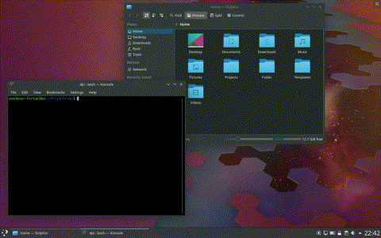

# dpiswitch — a KDE Plasma DPI switcher

Configure and automate KDE Plasma DPI scaling from the command line by using a JSON-based configuration file with different profiles.

<p align="center">
  
</p>

---

## Purpose
This tool is particularly handy for people who need different scaling factors at different times. Such as using a laptop where the built in display and the external one(s) need different scaling values.

Manually changing DPI settings, panel height/width, clock font or other settings for widgets each time the computer is connected to a different display is tedious.

This tool will automatically update all the necessary settings reducing manual work to a minimum.

## Installation

### Requirements

- Python 3
- Python 3 setuptools

### Install
```bash
git clone https://github.com/maldoinc/plasma-dpi-switcher
cd plasma-dpi-switcher
sudo python3 setup.py install --record files.txt
```

### Uninstall

```bash
rm $(cat files.txt)
```

## Getting started

The default installation will contain no profiles. The user needs to generate all of them either manually as described below or automatically using the `--generate` flag.

The typical scenario for generating two profiles, a "default" one and a "scaled" one (for HiDPI/loDPI screen combination) is as follows:

- Reset everything to 1.0 scaling
- run `$ dpiswitch --generate --profile default` 
- Scale screens, fonts, cursor, panels etc according to needs
- Log out and log in (so that plasma can save settings and apply the scale factors)
- run `$ dpiswitch --generate --profile scaled`
- Quickly switch between them by following the [Usage](#usage) section


## Usage

`$ dpiswitch [--config profiles.json] [--profile name]`

If no value for `config` is specified, it will default to `~/.config/maldoinc/dpiswitch/profile.json`. If `profile` is omitted, then a menu listing all the profiles will be shown.

> NB: Executing `dpiswitch` will kill your current plasma session, so make sure not to have any unsaved work.

---

Users may use the `--generate` switch to create a profile based on the current system settings. The config generation switch will not add any widget settings to it. They need to be added manually. The [Widget and Panel configuration](#widget-and-panel-configuration) describes how to locate and identify the groups for various configurations that the installed widgets are saving.

> NB: It is strongly recommended to log out and log in before using the `--generate` switch if you modified any settings such as panel height/width or widget configuration so that plasma will be able to save them to disk. 

## Sample configuration

A sample `profile.json` file which scales the screen, fonts, sets the height of the bottom panel and updates widget configuration is provided below:

> NB: The actual groups in the `panels` and `widgets` keys will be different in your system. 
```json
{
    "version": "1.0",
    "profiles": [{
        "name": "laptop",
        "description": "Set scaling to 1.5",
        "scaling": 1.5,
        "cursor": {
            "size": 36
        },
        "panels": [{
            "groups": ["PlasmaViews", "Panel 2", "Horizontal1920"],
            "thickness": 50
        }],
        "widgets": [{
            "groups": ["Containments", 2, "Applets", 22, "Configuration", "General"],
            "key": "clock_maxheight",
            "value": 36
        }]
    }]
}

```

## Widget and Panel configuration

Plasma configuration is stored in a [INI-like](https://en.wikipedia.org/wiki/INI_file) syntax in the following locations

| Config. | Filename  | 
|---|---|
| Panels | `~/.config/plasmashellrc` |
| Widgets | `~/.config/plasma-org.kde.plasma.desktop-appletsrc` |

### Panel scaling example

While this paragraph shows how to change the "thickness" of panels, the same method can be used to update widgets. Panel "thickness" denotes width or height, depending on whether the panel is horizontal or vertical.

In order to scale the panel's width or height one must locate the panel's Groups/Sections and use them in the configuration file to identify it.

An example configuration of a bottom panel:
```ini
[PlasmaViews][Panel2][Horizontal1920]
thickness=38
```

each of the groups is an element inside the object inside the `groups` array. The above example would get translated into

```json
{
    "groups": ["PlasmaViews", "Panel2", "Horizontal1920"],
    "thickness": "<New thickness>"
}
```

### Limitations

* Executing this tool will kill your Plasma session in order not to have the DE overwrite the newly updated values.
* A logout is needed for all the DPI scaling features to be fully applied.
* Beware that Plasma's fractional scaling is a work in progress and may cause different glitches and/or artifacts throughout the desktop or programs. Use integer scaling factors for best results.


## Future work

* A GUI to manage these profiles in addition to the command line.

## Issue reporting

* Please report only issues directly related to this project or misbehavior caused by applying this tool. 
* Unless caused by applying `dpiswitch`, glitches, artifacts, blurry text etc should be reported over at the [KDE Bug tracker](https://bugs.kde.org).
